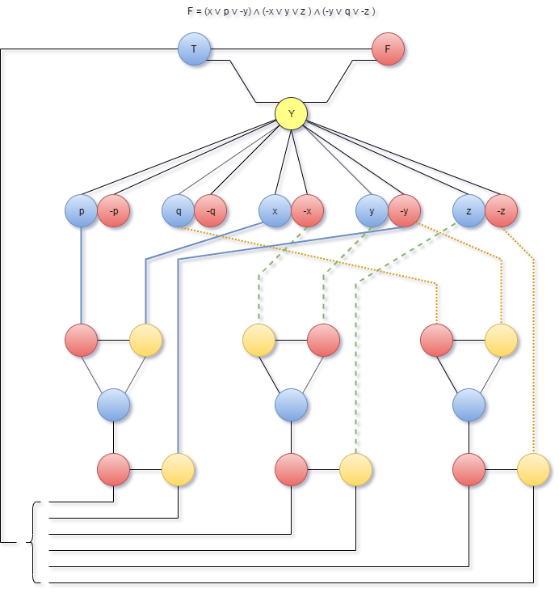

# Reduction from SAT to 3SAT & 3SAT to 3COL

## Lab 2: NP-Completeness

**(1)**
This problem concerns the proof of the NP-completeness of 3-SAT

---

**(1.1)**
Convert the formula F into a 3SAT formula, using the construction/reduction.
```
F = (x ∨ p) ∧ (-x ∨ y ∨ z ∨ -p) ∧ (-y ∨ q ∨ -z)

c1 = (x ∨ p)
c2 = (-x ∨ y ∨ z ∨ -p)
c3 = (-y ∨ q ∨ -z)
```

<br>

**c1**
- k=2
- 1 extra variable w1
- 2 clauses

<br>

c1 formula in 3CNF:
```
c1' =
[z1]  (  x v  p v  w1)   &
[z2]  (  x v  p v -w1)
```

<br>

**c2**
- k=4
- 1 extra variable w1
- 2 clauses

<br>

c2 formula in 3CNF:
```
c2' =
[z3]  (  -x v  y v  w2)   &
[z4]  ( -w2 v  z v  -p)
```

<br>

**c3**
- k=3
- no extra variable
- no extra clauses

<br>

c3 formula in 3CNF:
```
c3' = (-y ∨ q ∨ -z)
```


**(1.2)**
Find a truth solution for the 3SAT instance of F and verify that it is solution for the original problem.

```
 p = TRUE
 q = FALSE
 x = FALSE
 y = FALSE
 z = FALSE
w1 = TRUE
w2 = FALSE

c1 = (x ∨ p)                | TRUE
  z1 = (x ∨ p  ∨ w1 )       | TRUE
  z2 = (x ∨ p  ∨ -w1 )      | TRUE


c2 = (-x ∨ y ∨ z ∨ -p)      | TRUE
  z3 = (-x ∨ y  ∨ w2 )      | TRUE
  z4 = (-w2 ∨ z  ∨ -p )     | TRUE

c3 = (-y ∨ q ∨ -z)          | TRUE
  z5 = (-w2 ∨ z  ∨ -p )     | TRUE

Z = z1 ∧ z2 ∧ z3 ∧ z4 ∧ z5  = TRUE
C = c1 ∧ c2 ∧ c3            = TRUE
```

<br>

---

**(2)**
This problem concerns the proof of the NP-completeness of 3COL

---

**(2.1)**
Convert the formula F into a 3COL graph

```
F = (x ∨ p ∨ -y) ∧ (-x ∨ y ∨ z ) ∧ (-y ∨ q ∨ -z )
```



---

**(2.2)**
Find a solution for the 3COL instance of F and verify that it is a solution for
the original problem.

A simple solution to the 3COL problem would be
```
p = q = x = y = z = TRUE
```

```
F = (x ∨ p ∨ -y) ∧ (-x ∨ y ∨ z ) ∧ (-y ∨ q ∨ -z )
  = (T ∨ T v  F) ∧ ( F ∨ T ∨ T ) ∧ ( F ∨ T ∨  F)
  =      T       ∧       T       ∧       T
  = T
```
